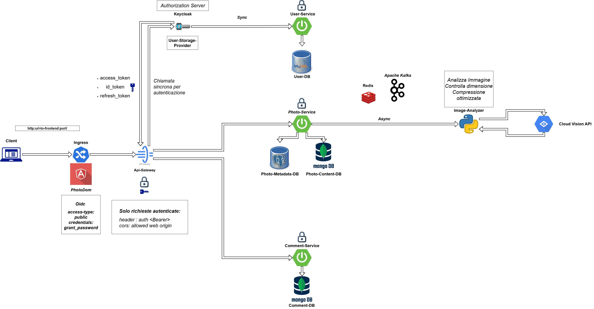

<p align="right">
  <a href="./README.md">🇮🇹 Italiano</a> |
  <strong>🇬🇧 English</strong>
</p>

# Photo-Dom – Technical Documentation


**Photo-Dom** is a social application built from scratch, designed as a management system, created to explore and implement:

### Main Objectives
- **Microservices architecture.**
- **Advanced technology skills.**
- **Scalability, resilience, asynchronous communication, KPI optimization, learn by doing.**

---

## Requirements

- Flexible structure for future additions.  
- Horizontal scalability.  
- Cost containment.  
- Resilient architecture.

---

## Features

- Secure registration/login with roles (Admin/User).  
- Photo upload, management and interaction.  
- Real-time likes and comments via WebSocket.  
- Admin dashboard for user management.  
- Safe-search to ensure content safety.

---

## General Networking

### Topology

- Angular frontend via HTTP/WebSocket.  
- API Gateway as single entry point.  
- REST and Kafka communications between microservices.  
- Dedicated databases: MongoDB, MySQL, PostgreSQL.  
- Distributed caching: Redis.  
- Security: Keycloak as Identity Provider.

### Diagram



---

## Core Concepts

- **Single Responsibility Principle** applied.  
- **Event-Driven Architecture** via Kafka.  
- **Resilience** via Circuit Breaker (Resilience4J).  
- **Advanced security** with OIDC, OAuth2, JWT, Keycloak.

---

## Technologies Used

### Backend

- **Java 17+** & **Spring Boot 3.3.7**  
- **Python 3.10** with **Pillow**, **python-kafka**, **redis**  
- **Spring Security**  
- **MongoDB**, **MySQL**, **Redis**, **Apache Kafka**, **Loki**, **PostgreSQL**

### Frontend

- **Angular 22**  
- **Angular Material**  
- **RxJS**, **WebSocket**  
- **Bootstrap 5.3.3**

---

## Key Features

- Secure user management (Keycloak & OAuth2 with JWT support).  
- Role-based access control.  
- CRUD for photos, comments, likes.  
- Additional moderation view for ADMIN.  
- Image filtering of illicit content via **Cloud Vision API** + optimized **Python Service**.  
- Centralized logging with **Loki**.  
- Live monitoring dashboard with **Grafana**.

---

## Main Folder Structure

| Folder                       | Description                                                           |
| :--------------------------- | :-------------------------------------------------------------------- |
| `api-gateway/`               | Central API Gateway (Spring Cloud)                                    |
| `user-service/`              | User-management microservice (Java Spring)                            |
| `photo-service/`             | Photo-management microservice (Java Spring)                           |
| `comment-service/`           | Comment-management microservice (Java Spring)                         |
| `image-analyzer-service/`    | Python image-analysis service (Google Vision API)                     |
| `user-provider/`             | Maven module for Keycloak–User-Service integration                    |
| `front-end/`                 | Angular frontend application                                          |
| `k8s/manifests/`             | Kubernetes manifests for infrastructure and services                  |
| `Docker/`                    | Dockerfiles and database configurations                               |
| `setup.ps1`                  | PowerShell script to set up Kind cluster and deploy                   |
| `create-kind-cluster.ps1`    | PowerShell script to create Kind cluster                              |
| `delete-kind-cluster.ps1`    | PowerShell script to delete Kind cluster and clean `/etc/hosts`       |
| `README.md`                  | Italian README (default)                                              |

---

## Internal Communications

- **REST API** for user management and login.  
- **Kafka topics** for asynchronous events (photo uploaded, photo analyzed).  
- **WebSocket** for real-time notifications.

---

# Local Deployment Guide

## Prerequisites

- Docker Desktop installed.  
- Kubernetes enabled.  
- Kind installed.  
- Node.js and npm installed.

> **⚠️ Kubernetes deploy limited to 1 replica:**  
> For resource reasons, all microservices run with a single replica in the local Kind cluster. The infrastructure is nonetheless ready for any environment (on-prem or cloud), with preference for cloud to leverage scalability and high availability.

> **⚠️ Docker Compose deploy:**  
> You can also deploy via Docker Compose for local testing. Update the frontend environment URLs in  
> `front-end/photo-dom/src/environments/environment.ts` as commented, then run:
> ```bash
> docker-compose up -d --build
> ```

---

## Cloud Vision API ⚠️

To use the image-analysis feature:

1. Sign in to [Google Cloud Vision](https://cloud.google.com/vision).  
2. In the [Google Cloud Console](https://console.cloud.google.com), create or select a project.  
3. Enable the Cloud Vision API.  
4. In the left menu go to **IAM & Admin > Service Accounts**.  
5. Select or create a Service Account.  
6. Under **Actions** click the three dots → **Manage Keys**.  
7. In **Keys** tab click **Add Key > Create new key**. Choose **JSON**, then **Create**.  
8. Rename the downloaded `credentials.json` to `api-Google.json`.  
9. Copy it into `image-analyzer-service/credentials/`.  
>  
> **❗ Without this step, upload feature will not work.**

---

## Startup Procedure

1. **Clone the repo**:  
   ```bash
   git clone https://github.com/Avalanche-git-dev/PhotoDom.git
   cd PhotoDom-MicroServices
   ```
   > **❗** Ensure you completed the Cloud Vision API setup above.

2. **Create Kind cluster**:  
   ```bash
   ./create-kind-cluster.ps1
   ```

3. **Run full setup**:  
   ```bash
   ./setup.ps1
   ```

4. **Check Pods**:  
   ```bash
   kubectl get pods
   ```
   Wait until all are in `Running` state.

5. **Port-forward Keycloak**:  
   ```bash
   kubectl port-forward svc/keycloak 8180:8180
   ```

6. **Port-forward API Gateway**:  
   ```bash
   kubectl port-forward svc/api-gateway 8080:8080
   ```

7. **Port-forward Frontend**:  
   ```bash
   kubectl port-forward svc/front-end 4200:80
   ```

8. **Open the app**:  
   Navigate to [http://localhost:4200](http://localhost:4200)

> **❗** If you get errors, wait 2–3 minutes: Kubernetes may need extra time to spin up all services.

---

## Utils & Monitoring

1. **Port-forward Grafana**:  
   ```bash
   kubectl port-forward svc/grafana 3000:3000
   ```
   → [http://localhost:3000](http://localhost:3000)

2. **Port-forward Kafka-UI**:  
   ```bash
   kubectl port-forward svc/kafka-ui 8090:8090
   ```
   → [http://localhost:8090](http://localhost:8090)

3. **Open Keycloak console**:  
   → [http://localhost:8180](http://localhost:8180)

4. **Delete cluster & clean hosts**:  
   ```bash
   ./delete-kind-cluster.ps1
   ```

---

## Deliverables & Testing

### API Documentation

Each service provides OpenAPI docs:

- **User Service**: [http://localhost:8080/swagger-ui.html](http://localhost:8080/swagger-ui.html)  
- **Photo Service**: [http://localhost:8080/swagger-ui.html](http://localhost:8080/swagger-ui.html)  
- **Comment Service**: [http://localhost:8080/swagger-ui.html](http://localhost:8080/swagger-ui.html)  

JSON specs in `docs/api/`:

| File                           | Service             |
| :----------------------------- | :------------------ |
| `docs/api/user-api.json`       | user-service        |
| `docs/api/photo-api.json`      | photo-service       |
| `docs/api/comment-api.json`    | comment-service     |

#### Offline Viewing

Import into Swagger Editor:

1. Open [editor.swagger.io](https://editor.swagger.io).  
2. **File > Import File** → select spec from `docs/api`.

---

### API Testing

Postman collections in `docs/test/`:

- **User**: `PhotoDom-MicroServices-User.postman_collection.json`  
- **Admin**: `PhotoDom-MicroServices-Admin.postman_collection.json`  
- **Keycloak**: `PhotoDom-MicroServices-Keycloak.postman_collection.json`  
- **Photo**: `PhotoDom-MicroServices-Photo.postman_collection.json`  
- **Comment**: `PhotoDom-MicroServices-Comment.postman_collection.json`  
- **API Gateway**: `PhotoDom-MicroServices-APIGATEWAY.postman_collection.json`  
- **WebFlow**: `PhotoDom-MicroServices-WebFlow-TEST.postman_collection.json`  

> **⚠️** Obtain a Bearer token (TokenId or TokenIdAdmin via WebFlow) before calling any protected endpoint.

Import in Postman via **File > Import**.

---

# Learning Objectives

- Building microservices architectures.  
- Cloud-native applications.  
- Secure authentication management.  
- Horizontal scalability, resilience, distributed logging.  
- Synchronous and asynchronous communication.  
- Integration of heterogeneous systems and applications.

---

# Contributor

- [Mohamed Gabr Ashour](https://github.com/Avalanche-git-dev) – **Full-Stack Developer**

---

> **Photo-Dom**: not just an app, but a full distributed ecosystem for learning and improvement.
