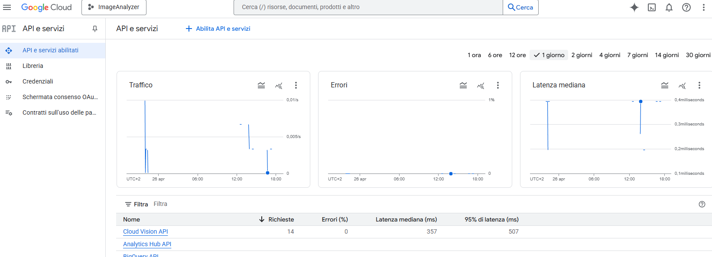

<p align="right">
  <strong>🇮🇹 Italiano</strong> |
  <a href="./README.en.md">🇬🇧 English</a>
</p>

# Photo-Dom - Documentazione Tecnica

**Photo-Dom** è un'applicazione social sviluppata da zero considerabile pertanto di tipo gestionale, progettata per esplorare e implementare:

### Obiettivi principali:
- **Architettura a microservizi**.
- **Competenze tecnologiche avanzate**.
- **Scalabilità, resilienza, comunicazione asincrona, ottimizzazione KPI, learn by doing**.

---

## Requisiti

- Struttura flessibile per aggiunte future.
- Scalabilità orizzontale.
- Contenimento dei costi.
- Architettura resiliente.

---

## Features

- Registrazione/login sicuro con ruoli (Admin/User).
- Caricamento, gestione e interazione sulle foto.
- Like e commenti in real-time via WebSocket.
- Admin dashboard per la gestione degli utenti.
- Visione di contenuti sicuri grazie al safe-search.

---

## General Networking

### Topologia
- Frontend Angular via HTTP/WebSocket.
- API Gateway come punto unico di ingresso.
- Comunicazioni REST e Kafka tra microservizi.
- Database dedicati: MongoDB, MySQL, PostgreSQL.
- Caching distribuito: Redis.
- Sicurezza: Keycloak come Identity Provider.

### Diagramma


---

## Concetti Generali

- **Single Responsibility Principle** applicato.
- **Event-Driven Architecture** tramite Kafka.
- **Resilienza** tramite Circuit Breaker (Resilience4J).
- **Sicurezza avanzata** con OIDC, OAuth2, JWT, Keycloak.

---

## Tecnologie Utilizzate

### Backend
- **Java 17+** e **Spring Boot 3.3.7**
- **Python 3.10** con **Pillow** , **Python-kafk** e **Redis** 
- **Spring Security**
- **MongoDB**, **MySQL**, **Redis**, **Apache Kafka**, **Loki**, **PostgreSQL**

### Frontend
- **Angular 22**
- **Angular Material**
- **RxJS**, **WebSocket**
- **Bootstrap 5.3.3**

---

## Caratteristiche principali

- Gestione utenti sicura (Keycloak e OAuth2 con supporto di Jwt).
- Gestione ruoli e accessi.
- CRUD foto, commenti, likes.
- Vista aggiuntiva di moderazione per ADMIN.
- Filtraggio immagini con contenuti non leciti tramite **Cloud Vision API** + ottimizzazione **Servizio Python**.
- Logging centralizzato con **Loki**.
- Dashboard per monitoraggio live **Grafana**.

---

## Struttura delle Cartelle Principali

| Cartella                          | Descrizione                                                          |
| :-------------------------------- | :------------------------------------------------------------------- |
| [`api-gateway/`](api-gateway/README.md)                  | Gateway API centrale (Spring Cloud)                                  |
| [`user-service/`](user-service/README.md)                   | Microservizio gestione utenti (Java Spring)                          |
| [`photo-service/`](photo-service/README.md)                  | Microservizio gestione foto (Java Spring)                            |
| [`comment-service/`](comment-service/README.md)                | Microservizio gestione commenti (Java Spring)                        |
| [`image-analyzer-service/`](image-analyzer-service/README.md)         | Servizio Python per analisi immagini (Google Vision API)             |
| [`user-provider/`](user-provider/README.md)                   | Modulo Maven per integrazione Keycloak - User-Service.             |
| [`front-end/`](front-end/README.md)                      | Applicazione frontend Angular                                        |
| `k8s/manifests/`                  | Manifests Kubernetes per infrastruttura e servizi                    |
| `Docker/`                         | Dockerfile e configurazioni database                                |
| `setup.ps1`                       | Script PowerShell per setup cluster Kind e deploy                    |
| `create-kind-cluster.ps1`         | Script PowerShell per creare cluster Kind                            |
| `delete-kind-cluster.ps1`         | Script PowerShell per cancellare cluster Kind e pulire \`/etc/hosts\`|
| `README.md`                       | Guida completa                                                       |

---

## Comunicazioni interne

- **REST API** per user management e login.
- **Kafka topics** per eventi asincroni (foto caricate, foto analizzata).
- **WebSocket** per notifiche real-time.

---

# Guida Deploy Locale: 

## Prerequisiti

- Docker Desktop installato.
- Kubernetes abilitato.
- Kind installato.
- NodeJS e npm installati.

> **⚠️ Deploy Kubernetes limitato a 1 replica:**  
> Per motivi di risorse, tutti i microservizi vengono avviati con una singola replica nel cluster locale Kind. L’infrastruttura è comunque pensata per essere deployabile in qualunque ambiente (on-premise o cloud), con preferenza per il cloud per sfruttarne scalabilità e alta disponibilità.


> **⚠️ Deploy Docker:**
> E' possibile deployare l'applicazione anche come docker-compose a scopo di test in locale, con unica differenza che bisogna avviare il front-end, cambiando i puntamenti in \front-end\photo-dom\src\environments\environment.ts con le indicazioni lasciate nei commenti. Fatto ciò basterà seguire le istruzioni lasciate nel Dockerfile al percorso \front-end\photo-dom\ e lanciare in seguito il comando
```bash
   docker-compose up -d --build
```


## Cloud Vision API ⚠️

Per poter utilizzare l'analisi immagini:

1. Registrarsi su [Google Cloud Vision](https://cloud.google.com/vision).
2. Apri il [Google Cloud Console](https://console.cloud.google.com) e crea un nuovo progetto o selezionane uno esistente.
3. Abilitare Cloud Vision API.
    
4. Nel menu a sinistra, vai su **IAM & Admin** > **Service Accounts**. 
5. Seleziona il Service Account che vuoi usare (o creane uno nuovo con **Create Service Account**).  
6. Nella riga del Service Account, clicca sui tre puntini in **Actions** → **Manage keys**  
7. Vai nella tab **Keys**, poi clicca **Add Key** → **Create new key**. 
    
8. Scegli il formato **JSON** e premi **Create**.  
9. Il file `credentials.json` verrà scaricato automaticamente nella cartella predefinita del tuo browser.  
10. Rinominarlo in `api-Google.json`.
11. Copiarlo nella cartella `image-analyzer-service/credentials/` del progetto.
> **❗ Attenzione:** Senza questo passaggio non sarà possibile il funzionamento della funzionalità di upload. 
---

# Procedura di Avvio

1. **Clona il repository**:
   ```bash
   git clone https://github.com/Avalanche-git-dev/PhotoDom.git
   cd PhotoDom-MicroServices
   ```
> **❗ Attenzione:** assicurarsi di aver completato la sezione soprastante Cloud Vision API ⚠️. 


2. **Crea il cluster Kind**:

   ```bash
   ./create-kind-cluster.ps1
   ```

3. **Esegui il setup completo**:
   ```bash
   ./setup.ps1
   ```

4. **Controlla i Pod**:
   ```bash
   kubectl get pods
   ```

   Attendere finché tutti i container risultano in stato `Running`.


5. **Esegui il port-forward Keycloak**:
   ```bash
   kubectl port-forward svc/keycloak 8180:8180
   ```

6. **Esegui il port-forward API-Gateway**:
   ```bash
   kubectl port-forward svc/api-gateway 8080:8080
   ```

7. **Esegui il port-forward Frontend**:
   ```bash
   kubectl port-forward service/front-end 4200:80
   ```

8. **Accedi all'applicazione**:
   - Apri il browser su [http://localhost:4200](http://localhost:4200)


> **❗ Nota** In caso di errori iniziali attendere 2-3 minuti: Kubernetes potrebbe impiegare più tempo ad avviare tutto.


# Utils & Monitoring


1. **Esegui il port-forward Grafana**:
   ```bash
   kubectl port-forward svc/grafana 3000:3000
   ```

2. **Accedi a Grafana**:
   - Apri il browser su [http://localhost:3000](http://localhost:3000)

3. **Esegui il port-forward Kafka-ui**:
   ```bash
   kubectl port-forward svc/kafka-ui 8090:8090
   ```

4. **Accedi a Kafka-ui**:
   - Apri il browser su [http://localhost:8090](http://localhost:8090)


5. **Accedi alla console di Keycloak**:
   - Apri il browser su [http://localhost:8180](http://localhost:8180)
  

6. **Per eliminare il cluster e pulire il file hosts**:
   ```bash
   ./delete-kind-cluster.ps1
   ```  

---


# Deliverable e Testing


## **Documentazione API**

Ogni servizio ha la sua documentazione OpenAPI:

- **User Service**: [http://localhost:8080/swagger-ui.html](http://localhost:8080/swagger-ui.html)
- **Photo Service**: [http://localhost:8080/swagger-ui.html](http://localhost:8080/swagger-ui.html)
- **Comment Service**: [http://localhost:8080/swagger-ui.html](http://localhost:8080/swagger-ui.html)

I file di specifica JSON sono disponibili in `docs/api/`:

| File                          | Servizio        |
| :---------------------------- | :-------------- |
| `docs/api/user-api.json`    | [user-service](docs/api//user-api.json)    |
| `docs/api/photo-api.json`   | [photo-service](docs/api//user-api.json)    |
| `docs/api/comment-api.json` | [comment-service](docs/api//user-api.json)    |

---

### Consultazione senza deploy

Puoi importare i file direttamente nel **Swagger Editor**:

1. Apri il [Swagger Editor online](https://editor.swagger.io/).  
2. Vai su **File > Import File**.  
3. Seleziona il file desiderato da `docs/api`.  

In questo modo potrai esplorare la documentazione OpenAPI senza dover avviare i servizi in locale.  

---
## **Test delle API**

Le collection Postman per testare le API sono disponibili nei seguenti file:

- **User Controller**: [Scarica](docs/test/PhotoDom-MicroServices-User.postman_collection.json)
- **Admin Controller**: [Scarica](docs/test/PhotoDom-MicroServices-Admin.postman_collection.json)
- **Keycloak Controller**: [Scarica](docs/test/PhotoDom-MicroServices-Keycloak.postman_collection.json)
- **Photo Controller**: [Scarica](docs/test/PhotoDom-MicroServices-Photo.postman_collection.json)
- **Comment Controller**: [Scarica](docs/test/PhotoDom-MicroServices-Comment.postman_collection.json)
- **ApiGateway**: [Scarica](docs/test/PhotoDom-MicroServices-APIGATEWAY.postman_collection.json)
- **WebFlow Endpoint**: [Scarica](docs/test/PhotoDom-MicroServices-WebFlow-TEST.postman_collection.json)

> **⚠️ Attenzione:** Prima di testare una API è necessario richiedere un token tramite TokenId, o TokenIdAdmin previste nella WebFlow Endpoint, utilizzandone il token risultato come header di tipo Bearer sarà possibile chiamare il backend da autenticati. In caso contrario sarà vietato l'accesso.


Puoi importare questi file in Postman:
1. Apri Postman.
2. Vai su **File > Import**.
3. Carica il file JSON.
---

# Learning Objectives

- Realizzazione architetture a microservizi.
- Cloud Native Application.
- Gestione sicura delle autenticazioni.
- Scalabilità orizzontale, resilienza e logging distribuito.
- Comunicazione sincrona e asincrona.
- Integrazione fra piu sistemi e applicativi di tipo diverso fra loro.

---

# Contributore

- [Mohamed Gabr Ashour](https://github.com/Avalanche-git-dev) - **Sviluppatore full-stack**

---

> **Photo-Dom**: non solo un'applicazione, ma un ecosistema distribuito completo per imparare e migliorarsi.

