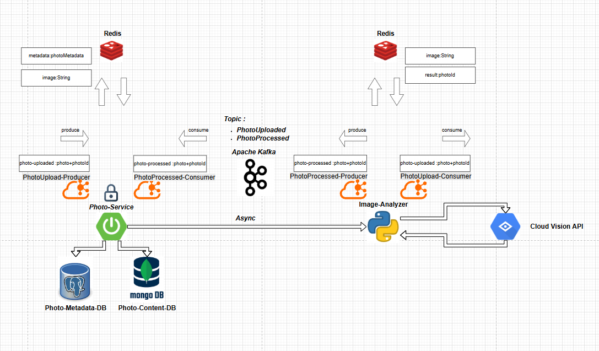

<p align="right">
  <strong>🇬🇧 English</strong> |
  <a href="./README.md">🇮🇹 Italiano</a>
</p>

# Image-Analyzer-Service

Microservice part of the **Photo-Dom** project, responsible for the **automatic analysis of uploaded images**.
Uses Artificial Intelligence for safe-search and optimizes images through compression.

---

## ✨ Main Features

- Asynchronous event consumption from **Kafka** (`photo-uploaded` topic).
- Content analysis through **Google Cloud Vision API** (Safe Search Detection).
- Image compression and optimization using **Pillow** (without significant quality loss).
- Publishing processed events back to **Kafka** (`photo-processed` topic).
- Intensive use of **Redis** as a temporary cache for images and metadata.

---

## 💾 Main Structure

| Folder/File        | Description                                 |
| :----------------- | :------------------------------------------ |
| `services/`         | AI module for image analysis and compression |
| `utils/`            | Supporting utility functions                |
| `main.py`           | Main service entry point                    |

---

## ⚙️ Main Technologies and Libraries

| Technology/Stack           | Role                                   |
| :-------------------------- | :------------------------------------- |
| **Python 3.10+**            | Main programming language              |
| **kafka-python**            | Kafka Consumer and Producer            |
| **redis-py**                | Optimized access to Redis cache         |
| **pillow**                  | Image compression without quality loss |
| **google-cloud-vision**     | Safe Content Detection via AI          |
| **dotenv**                  | Environment variable management        |

---

## 🔗 External Communications

| System                  | Protocol  | Description                         |
| :---------------------- | :-------- | :---------------------------------  |
| **Photo-Service**        | Kafka     | Receives image upload events        |
| **Photo-Service**        | Kafka     | Sends back processed image events   |
| **Google Cloud Vision**  | HTTPS API | SafeSearch analysis of images       |
| **Redis**                | TCP       | Temporary caching for images/results|

---

## 🔐 Security

- Secure communication within Kubernetes internal network.
- Authentication to Google Cloud Vision via JSON key file.
- Kafka communication restricted to private network.

---

## 🛠️ Development Setup (Local)

1. Install Python dependencies:

```bash
pip install -r requirements.txt
```

2. Configure environment variables if necessary.

3. Run the microservice:

```bash
python app.py
```

> **⚠️** Ensure Redis, Kafka, and Photo-Service are running!

---

## 📃 Main Requirements (`requirements.txt`)

```text
kafka-python
redis
python-dotenv
pillow
google-cloud-vision
```

---

## 📊 Event-Driven Flow

- Consume `photo-uploaded` event from Kafka.
- Retrieve the image from **Redis**.
- Analyze the image using **Google Cloud Vision API**.
- Compress the image with **Pillow**.
- Publish a `photo-processed` event back to Kafka.
- Update metadata in **Redis** for the Photo-Service.



---

## 📊 Main Optimizations

- **Pillow** is used for:
  - Compressing images without significant visible loss.
  - Reducing backend load and processing time.
- **Batch-oriented caching** with Redis:
  - Uniform JSON serialization.
  - Minimization of Redis server load.

---

## 👩‍💻 Contributor

- [Mohamed Gabr Ashour](https://github.com/Avalanche-git-dev)

---

# 🌟 Status

**Completed** — Ready for development and production environments.
