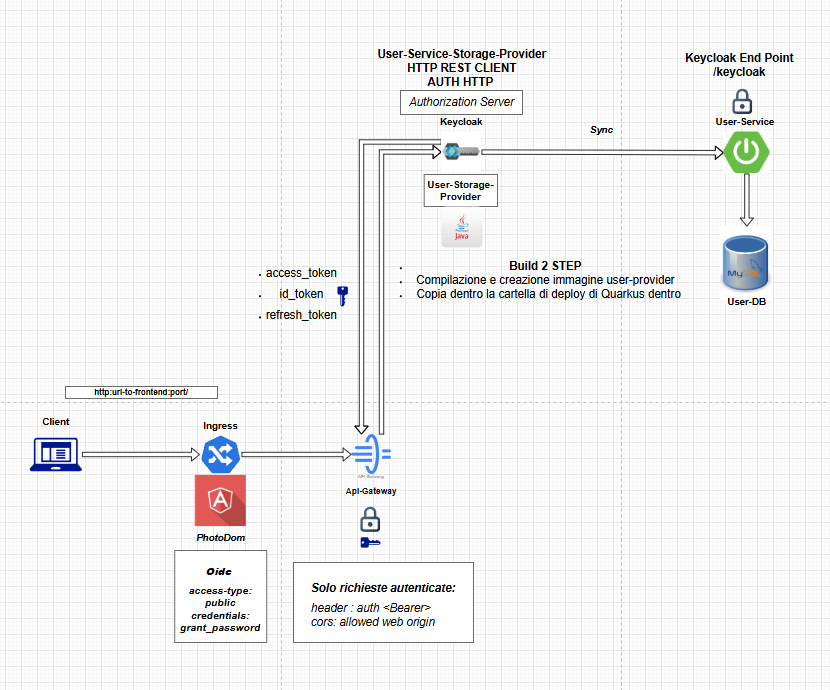

<p align="right">
  <a href="./README.md">🇮🇹 Italiano</a> |
  <strong>🇬🇧 English</strong>
</p>

# User-Provider

Custom Maven module developed for the **Photo-Dom** project, responsible for the integration between **Keycloak** and the **user-service** microservice.

It allows Keycloak to delegate external user management through the **User Storage SPI** protocol.

---

## ✨ Main Features

- Full implementation of a **User Storage Provider** for Keycloak.
- Secure communication with **user-service** through Keycloak internal HTTP.
- Complete support for:
  - User login and authentication.
  - User search by ID, username, and email.
  - User search with pagination.
  - Credentials validation.
- Internal caching by ID, email, and username.
- Deployable as `.jar` inside Keycloak.

---

## 💥 Main Structure

| Folder/File        | Description                                   |
| :------------------- | :-------------------------------------------- |
| `provider/`           | Main User Storage SPI classes               |
| `adapter/`            | Adapter that maps UserDto into UserModel    |
| `client/`             | HTTP communication with user-service       |
| `dto/`                | Data Transfer Objects                      |

---

## ⚙️ Main Technologies and Libraries

| Technology/Stack        | Role                             |
| :---------------------- | :------------------------------- |
| **Java 17**              | Development Language             |
| **Keycloak 26.0.0**      | Identity Provider                |
| **SPI User Storage**     | Keycloak extension mechanism     |
| **SimpleHttp API**       | Internal REST communication for Keycloak |
| **Lombok**               | Boilerplate reduction            |

---

## 🔗 External Communication

| System           | Protocol | Description                                |
| :---------------- | :--------- | :---------------------------------------- |
| **user-service**   | REST      | User login, search, and ID management     |

---

## 🔐 Security

- **Basic Authentication** to authenticate against user-service.
- Always authenticated REST communication.
- No sensitive data stored inside Keycloak.

---

## 🛠️ Setup and Deployment

1. Build the jar:
   ```bash
   mvn clean package
   ```

2. Copy the file `user-provider-0.0.1-SNAPSHOT.jar` into the Keycloak providers directory.

3. Register the provider in the Keycloak admin console or via `standalone.xml` configuration.

4. Add the required parameters:
   - **Base URL** (e.g., http://localhost:8081/keycloak)
   - **Username** admin for basic auth
   - **Password** admin for basic auth

> **✅ Protected communication using OIDC, HTTP Basic Authentication, and password encryption in Base64.**

---

## 🔍 Main Maven Dependencies

```xml
<dependency>org.keycloak:keycloak-server-spi</dependency>
<dependency>org.keycloak:keycloak-server-spi-private</dependency>
<dependency>org.keycloak:keycloak-model-storage</dependency>
<dependency>org.keycloak:keycloak-services</dependency>
<dependency>org.projectlombok:lombok</dependency>
```

---

# 🌐 User Storage Authentication Flow



- Browser initiates login via **OIDC** to Keycloak.
- Keycloak delegates credential validation to **user-service**.
- If valid, Keycloak issues a **JWT Token** encapsulated in **OIDC**.
- The token is returned to the frontend.

---

# 👩‍💻 Contributor

- [Mohamed Gabr Ashour](https://github.com/Avalanche-git-dev)

---

# 🌟 Status

**Completed** - Ready for integration into Keycloak deployments.
