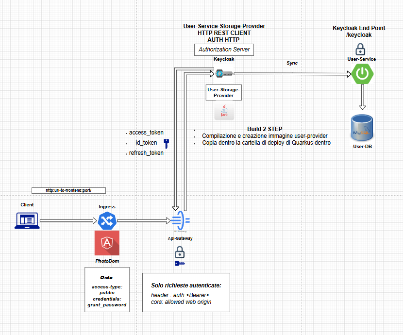

<p align="right">
  <strong>🇮🇹 Italiano</strong> |
  <a href="./README.en.md">🇬🇧 English</a> 
</p>

# User-Provider

Modulo Maven custom sviluppato per il progetto **Photo-Dom**, responsabile dell'integrazione tra **Keycloak** e il microservizio **user-service**.

Permette a Keycloak di delegare la gestione di utenti esterni tramite il protocollo **User Storage SPI**.

---

## ✨ Funzionalità principali

- Implementazione completa di uno **User Storage Provider** per Keycloak.
- Comunicazione sicura con **user-service** tramite HTTP interno di Keycloak.
- Supporto completo a:
  - Login e autenticazione utenti.
  - Ricerca utenti per ID, username ed email.
  - Paginazione e ricerca utenti.
  - Validazione credenziali.
- Caching interno su ID, email e username.
- Deployment come `.jar` all'interno di Keycloak.

---

## 💥 Struttura Principale

| Cartella/File        | Descrizione                                        |
| :------------------- | :------------------------------------------------- |
| `provider/`           | Classi principali SPI User Storage                |
| `adapter/`            | Adattatore che mappa l'oggetto UserDto in UserModel |
| `client/`             | Comunicazione HTTP con user-service               |
| `dto/`                | Oggetti di trasferimento dati                    |

---

## ⚙️ Tecnologie e Librerie Principali

| Tecnologia/Stack        | Ruolo                              |
| :---------------------- | :--------------------------------- |
| **Java 17**              | Linguaggio di sviluppo             |
| **Keycloak 26.0.0**      | Identity Provider                  |
| **SPI User Storage**     | Estensione Keycloak                |
| **SimpleHttp API**       | Comunicazione REST interna Keycloak|
| **Lombok**               | Riduzione boilerplate              |

---

## 🔗 Comunicazione Esterna

| Sistema           | Protocollo | Descrizione                                   |
| :---------------- | :---------- | :------------------------------------------- |
| **user-service**   | REST       | Login, ricerca utenti, gestione ID utenti    |


## 🔐 Sicurezza

- **Basic Authentication** per autenticarsi verso user-service.
- Comunicazione REST sempre autenticata.
- Nessun dato sensibile salvato all'interno di Keycloak.

---

## 🛠️ Setup e Deploy

1. Costruisci il jar:
   ```bash
   mvn clean package
   ```

2. Copia il file `user-provider-0.0.1-SNAPSHOT.jar` nella directory delle providers di Keycloak.
   
3. Registra il provider nel pannello Keycloak o tramite configurazione `standalone.xml`.

4. Aggiungi i parametri obbligatori:
   - **Base URL** (es: http://localhost:8081/keycloak)
   - **Username** admin per basic auth
   - **Password** admin per basic auth

> **✅ Comunicazione protetta tramite utilizzo di OIDC, Authenticazione HTTP protetta e da criptaggio della psw in base 64.**

---

## 🔍 Dipendenze Maven principali

```xml
<dependency>org.keycloak:keycloak-server-spi</dependency>
<dependency>org.keycloak:keycloak-server-spi-private</dependency>
<dependency>org.keycloak:keycloak-model-storage</dependency>
<dependency>org.keycloak:keycloak-services</dependency>
<dependency>org.projectlombok:lombok</dependency>
```

---

# 🌌 Flow di Autenticazione User Storage



- Il browser effettua login via **OIDC** su Keycloak.
- Keycloak delega la validazione delle credenziali al **user-service**.
- Se corrette, Keycloak emette un **JWT Token** encapsulato in **OIDC**.
- Il token viene restituito al frontend.

---

# 👩‍💻 Contributore

- [Mohamed Gabr Ashour](https://github.com/Avalanche-git-dev)

---

# 🌟 Stato

**Completato** - Pronto per integrazione nei deployment Keycloak.
